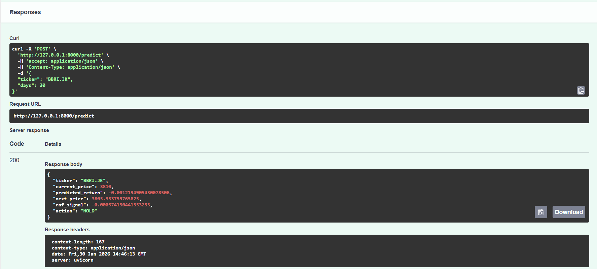

# 📈 Hybrid AI Stock Predictor


**A Machine Learning experiment combining Technical Analysis (XGBoost) with Historical Pattern Recognition (Retrieval-Augmented Forecasting / RAF).**


## 💡 Project Background

The motivation behind this project lies in addressing the **Efficiency-Accuracy Trade-off** in modern Financial AI.

With the rise of Large Language Models (LLMs) and deep transformers, there is a growing trend to apply massive, resource-intensive models to every problem. However, for numerical time-series data, this often leads to diminishing returns—where a slight increase in accuracy costs a massive amount of computational power.

**Research Gap:**
There is a need to prove that **lightweight, interpretable models** can achieve accuracy levels comparable to heavy deep learning models, provided they are architected correctly with context-awareness.

**The Solution:**
This project implements a **Hybrid Strategy** that combines the speed of classical ML with the "memory" capabilities usually found in GenAI:
1.  **XGBoost:** Highly optimized for numerical efficiency.
2.  **RAF (Retrieval-Augmented Forecasting):** A lightweight mechanism to inject historical context (similar to RAG in LLMs) without the overhead of a Neural Network.

**The Goal**
To demonstrate that we do not always need "Big AI" to solve complex problem. By focusing on smart feature engineering and pattern retrieval, this model aims to deliver **competitive accuracy with a fraction of the computational cost**.


---
## 🚀 Key Features

* **🧠 Hybrid Intelligence:** The final prediction is influenced by both technical calculations and historical analysis.
* **📡 API-First Architecture:** Decoupled Backend (FastAPI) and Frontend (Streamlit) for better scalability and modularity.
* **📊 Interactive Dashboard:** Real-time data visualization using `yfinance` and `matplotlib`.
* **🛡️ Robust Error Handling:** Implements strict data validation to prevent Shape Mismatch errors during inference.
* **🐳 Dockerized:** Container-ready for consistent deployment across different environments.

---

## 📸 Screenshots

### 1. Analysis Dashboard
Users can view current prices, AI predictions, and RAF signals (Neutral/Positive/Negative).


### 2. Backend API (Swagger UI)
Auto-generated API documentation built with FastAPI for endpoint testing.


---

## 🛠️ Tech Stack

| Component | Technology | Description |
| :--- | :--- | :--- |
| **Language** | Python 3.10 | Core programming language. |
| **ML Engine** | XGBoost, Scikit-Learn | Gradient Boosting regression model. |
| **Pattern Match**| NumPy (Custom Logic) | RAF algorithm using Euclidean distance vector search. |
| **Backend** | FastAPI, Uvicorn | High-performance asynchronous REST API server. |
| **Frontend** | Streamlit | Interactive web-based dashboard. |
| **Deployment** | Docker | Application containerization. |


---

## 📂 Project Structure

```bash
├── assets/             # Static images/assets
├── data/               # Local dataset storage (if needed)
├── models/             # Pre-trained ML models (.json)
├── notebook/           # Jupyter Notebooks for experiments & training
├── src/
│   ├── api.py          # Backend Entry point (FastAPI)
│   ├── dashboard.py    # Frontend Entry point (Streamlit)
│   ├── loader.py       # Model loading utility
│   └── raf.py          # Retrieval-Augmented Forecasting logic
├── Dockerfile          # Container configuration
├── requirements.txt    # Python dependencies
└── README.md           # Project documentation
```
---

## How to Run (Local)

1.  **Clone the Repository**
    ```bash
    git clone [https://github.com/Rustydinoco/Hybrid_Stock_Forecasting_api](https://github.com/Rustydinoco/Hybrid_Stock_Forecasting_api)
    cd Hybrid_Stock_Forecasting_api
    ```

2.  **Install Dependencies**
    ```bash
    pip install -r requirements.txt
    ```

3.  **Run Backend (Terminal 1) The server will start at http://localhost:8000.**
    ```bash
    uvicorn src.api:app --reload
    ```
     *Server will start at `http://127.0.0.1:8000`*

4.  **Run Frontend (Terminal 2) The dashboard will open in your default browser.**
    ```bash
    streamlit run src/dashboard.py
    ```

---

## How To Run Docker
**If you have Docker installed, you can build and run the entire application with a single container:**
```bash
# Build the Image
docker build -t stock-app .

# Run Container (Exposes API & Dashboard)
docker run -p 8000:8000 -p 8501:8501 stock-app
```
