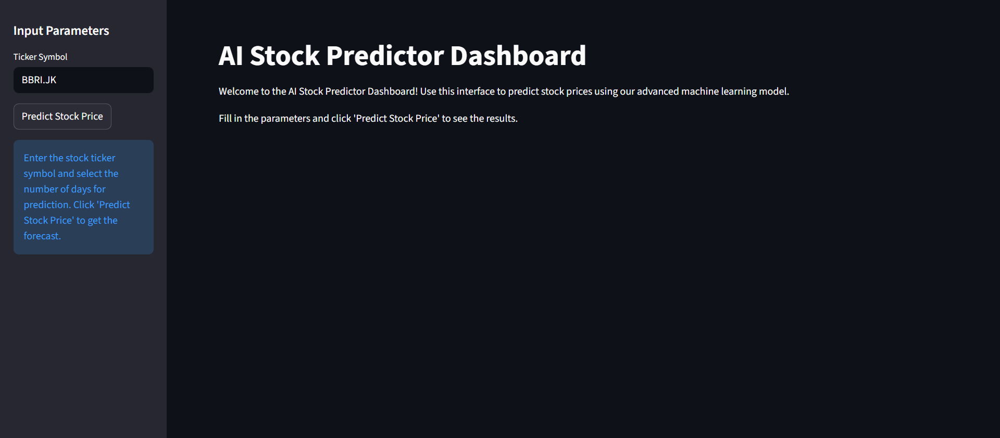
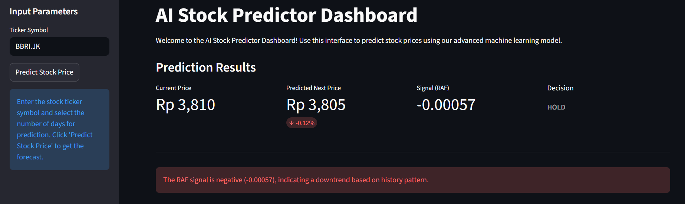

# 📈 Hybrid AI Stock Predictor


**A Machine Learning experiment combining Technical Analysis (XGBoost) with Historical Pattern Recognition (Retrieval-Augmented Forecasting / RAF).**



## 💡 Project Background

The inspiration for this project stemmed from identifying a specific **research gap** in modern Financial AI.

While recent trends focus heavily on **Large Language Models (LLMs)** combined with Retrieval-Augmented Forecasting (RAF), I noticed that applying LLMs to pure numerical time-series data can be computationally expensive and sometimes overkill.

**The Gap:**
Most "Retrieval" systems are designed for text (RAG). There is limited exploration on efficiently applying the **Retrieval-Augmented** concept to lightweight, numerical Machine Learning models.

**The Solution:**
Instead of using heavy LLMs, this project proposes a specialized **Hybrid Engine**:
1.  **XGBoost (The Logic):** An optimized gradient boosting model to handle 30+ technical indicators.
2.  **RAF Algorithm (The Memory):** A custom vector-search mechanism that finds historical "Dejavu" moments without the overhead of an LLM.

This approach aims to prove that we can achieve "Context-Aware" predictions efficiently without relying on Generative AI.
---

## 🚀 Key Features

* **🧠 Hybrid Intelligence:** The final prediction is influenced by both technical calculations and historical analysis.
* **📡 API-First Architecture:** Decoupled Backend (FastAPI) and Frontend (Streamlit) for better scalability and modularity.
* **📊 Interactive Dashboard:** Real-time data visualization using `yfinance` and `matplotlib`.
* **🛡️ Robust Error Handling:** Implements strict data validation to prevent Shape Mismatch errors during inference.
* **🐳 Dockerized:** Container-ready for consistent deployment across different environments.

---

## 📸 Screenshots

### 1. Analysis Dashboard
Users can view current prices, AI predictions, and RAF signals (Neutral/Positive/Negative).



### 2. Backend API (Swagger UI)
Auto-generated API documentation built with FastAPI for endpoint testing.


---

## 🛠️ Tech Stack

| Component | Technology | Description |
| :--- | :--- | :--- |
| **Language** | Python 3.10 | Core programming language. |
| **ML Engine** | XGBoost, Scikit-Learn | Gradient Boosting regression model. |
| **Pattern Match**| NumPy (Custom Logic) | RAF algorithm using Euclidean distance vector search. |
| **Backend** | FastAPI, Uvicorn | High-performance asynchronous REST API server. |
| **Frontend** | Streamlit | Interactive web-based dashboard. |
| **Deployment** | Docker | Application containerization. |


---

## 📂 Project Structure

```bash
├── assets/             # Static images/assets
├── data/               # Local dataset storage (if needed)
├── models/             # Pre-trained ML models (.json)
├── notebook/           # Jupyter Notebooks for experiments & training
├── src/
│   ├── api.py          # Backend Entry point (FastAPI)
│   ├── dashboard.py    # Frontend Entry point (Streamlit)
│   ├── loader.py       # Model loading utility
│   └── raf.py          # Retrieval-Augmented Forecasting logic
├── Dockerfile          # Container configuration
├── requirements.txt    # Python dependencies
└── README.md           # Project documentation